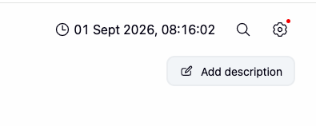
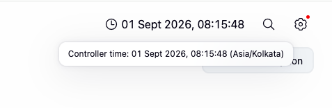

# Controller Clock

Controller Clock is a Jenkins plugin that shows the Jenkins controller time in the global header.

It stays in sync with the controller instead of the browser clock, so you can quickly see the controller's time and timezone when people or systems are working across timezones.

## Features

- Shows the controller time in the global header.
- Keeps the display updated after it syncs with Jenkins.
- Uses the controller, not the browser clock, as the reference.
- Shows the active Jenkins timezone in the tooltip.
- Makes timezone differences easier to spot.
- Needs no plugin-specific configuration after installation.
- Sends no telemetry, analytics, or outbound requests.

## Screenshots

### Controller time in the Jenkins header

The controller clock appears next to the standard Jenkins header controls.



### Controller timezone details

Hover over the clock to see the synced controller time and timezone.



## Requirements

| Requirement | Value |
| --- | --- |
| Jenkins | 2.541.3 or newer |
| Plugin ID | `controller-clock` |

## Installation

Install Controller Clock from the Jenkins Update Center:

1. Open **Manage Jenkins**.
2. Select **Plugins**.
3. Open **Available plugins**.
4. Search for **Controller Clock**.
5. Select the plugin and install it.

No extra configuration is needed. After installation, the controller clock appears in the Jenkins global header.

Plugin page: <https://plugins.jenkins.io/controller-clock/>

## Usage

Once installed, the clock is visible in the Jenkins global header.

It shows the controller time. Hover over it to see the time and the timezone Jenkins is using.

By default, Jenkins uses the controller JVM timezone. If the current user has a Jenkins timezone override, that timezone is shown instead.

This is useful when, for example:

- the Jenkins controller runs in a different timezone from the user's workstation;
- administrators need to compare Jenkins timestamps with local time;
- teams use Jenkins across multiple regions or timezones;
- build or scheduling investigations need a quick look at controller time.

## Privacy and network behavior

Controller Clock is a local Jenkins feature. It does not send telemetry, analytics, or any other outbound Internet traffic.

The browser only calls the Jenkins controller on the same origin to sync clock state.

## Development

Build the plugin and run the test suite:

```bash
mvn clean verify
```

Start a local Jenkins controller for manual testing:

```bash
mvn hpi:run -Dport=8090
```

Then open Jenkins in a browser and check that the controller clock shows up in the global header.

## Architecture

For implementation details, including sync and timezone handling, see [ARCHITECTURE.md](ARCHITECTURE.md).

## Contributing

Contributions are welcome. See [CONTRIBUTING.md](CONTRIBUTING.md) for development and contribution guidance.

Issues and feature requests can be reported in the [Jenkins Controller Clock Plugin issue tracker](https://github.com/jenkinsci/controller-clock-plugin/issues).

## Security

Please do not report security vulnerabilities through public GitHub issues.

Follow the process in [SECURITY.md](SECURITY.md) and the [Jenkins security reporting documentation](https://www.jenkins.io/security/reporting/).

## License

Controller Clock is licensed under the [Apache License, Version 2.0](LICENSE).
